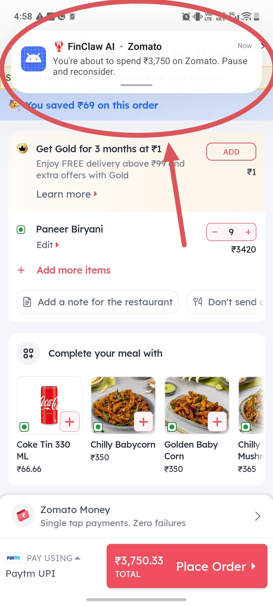
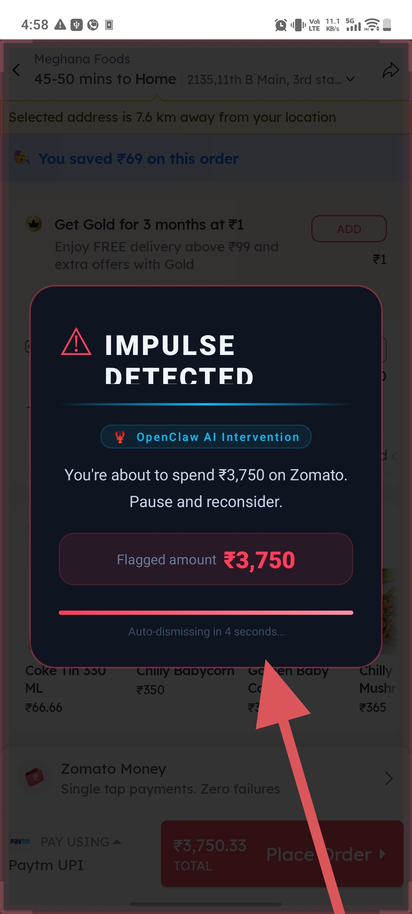
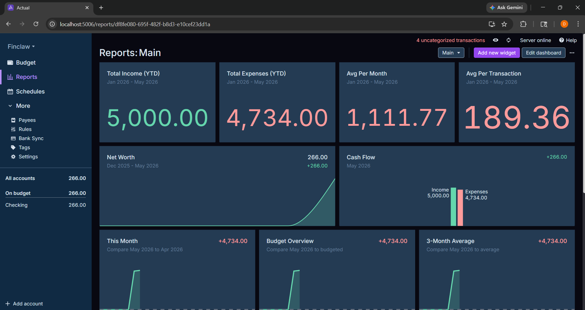
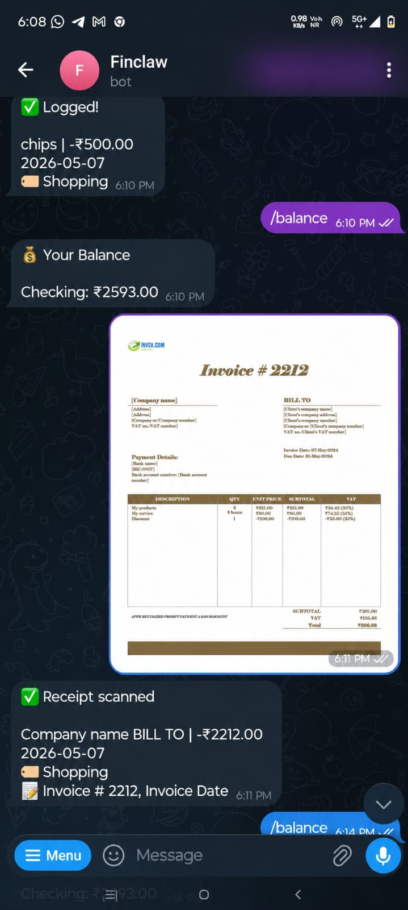

# FinClaw AI 🦞
### OpenClaw-Powered Emotional Spending Intervention System

> A real-time AI financial guardian that watches online checkout screens, understands what you are buying, and intervenes before impulsive spending happens.

---

## 1. Problem Statement

Digital spending has become effortless.

Online food ordering, shopping apps, flash sales, and one-click checkout flows make it extremely easy for users to spend money without pausing to think. In many cases, people overspend not because they lack financial discipline, but because the purchase experience is intentionally optimized to remove friction.

Traditional expense trackers are not enough. They only record transactions after the money has already been spent. They cannot:
- detect spending intent in real time,
- understand checkout behavior,
- analyze the emotional context of a purchase,
- warn the user before the transaction is completed,
- or adapt the warning based on remaining budget and spending patterns.

FinanceGuardian AI solves this by acting as a real-time autonomous financial intervention system.

It detects payment pages on apps like Swiggy, Zomato, Amazon, and Flipkart, extracts the amount and product details, categorizes the transaction intelligently, and uses OpenClaw to generate emotionally aware warnings that prompt the user to stop, pause, or reconsider the purchase before completing it.

---

## 2. What This Project Does

FinanceGuardian AI is an Android-based AI assistant that:

- detects checkout/payment screens in supported shopping and food delivery apps,
- reads the product title and transaction amount from the screen,
- categorizes the transaction into meaningful groups like Food, Shopping, Electronics, and Daily Utility,
- stores transaction history locally,
- uses OpenClaw for reasoning and intervention generation,
- sends warning notifications directly to the Android device,
- triggers a fullscreen impulse warning for high-risk spending,
- and prepares the data for dashboard analytics.

This project is not just a tracker.  
It is a behavioral spending guardian.

---

## 3. Core Features

### Real-Time Checkout Detection
Detects when the user reaches a purchase or payment screen in:
- Swiggy
- Zomato
- Amazon
- Flipkart
-(And any other Quick Commerce or Food delivery apps)

### Product Title Extraction
Reads visible product names from the screen such as:
- Burger Combo
- iPhone 15 Pro Max
- Detergent
- Shoes
- Laptop

### Intelligent Categorization
Automatically maps transactions into categories:
- Food
- Shopping
- Electronics
- Daily Utility
- Others

### OpenClaw AI Reasoning
OpenClaw analyzes:
- the product title,
- the amount,
- the app type,
- and the spending context

to generate emotionally intelligent warnings.

### Smart Warning System
- Normal notification for all detected transactions

- Fullscreen impulse overlay only when the purchase crosses a threshold

### Transaction Memory
Transactions are stored locally so future categories, charts, and behavioral analytics can be built on top.

### Dashboard Ready
The stored category data can drive:
- pie charts
- category summaries
- spending insights
- trend analysis


---

## 4. Why This Project Is Different

Most finance apps are reactive.

FinanceGuardian AI is proactive.

It does not wait for the user to spend and then report what happened.  
It observes the user at the exact moment of decision and tries to intervene before the purchase is completed.

That makes it more like an autonomous AI agent than a traditional expense tracker.

---

## 5. System Architecture

```text
Android Accessibility Service
        ↓
Checkout Screen Detection
        ↓
Amount + Product Title Extraction
        ↓
OpenClaw AI Reasoning
        ↓
Transaction Categorization
        ↓
Local Transaction Memory
        ↓
Android Notification / Fullscreen Intervention
        ↓
Dashboard Analytics
```

---

## 6. Tech Stack

### Android App

* Kotlin
* Jetpack Compose
* AccessibilityService
* NotificationCompat
* OkHttp
* Android overlay/notification APIs

### Backend

* Python
* Flask

### AI Layer

* OpenClaw
* Groq API
* LLM-based reasoning

### Storage

* Local JSON transaction memory
* `transactions.json`

### Visualization

* Dashboard pie charts
* Spending analytics
* Category breakdowns

---

## 7. System Requirements

### PC Requirements

* Windows 10 / Windows 11
* Python 3.11+
* Node.js 18+ or later
* Android Studio
* VS Code
* Git
* Minimum 8 GB RAM
* Recommended 16 GB RAM

### Smartphone Requirements

* Android 11+
* Accessibility permission enabled
* Notification permission enabled
* Overlay permission enabled
* Wireless debugging support recommended
* Internet connection for backend/LLM communication

---

## 8. Project Setup

### Step 1: Clone the repository

```bash
git clone <YOUR_REPOSITORY_URL>
cd FinClaw
```

---

### Step 2: Setup the backend

Go into the backend folder:

```bash
cd backend
```

Install dependencies:

```bash
pip install flask requests python-dotenv
```

Run the backend:

```bash
py -3.11 server.py
```

You should see:

```text
Running on http://0.0.0.0:5000
```

---

### Step 3: Configure OpenClaw

OpenClaw should be set up in the OpenClaw workspace folder.
Make sure the OpenClaw runtime is initialized and the model is configured correctly.

If needed, configure:

* Groq API key
* model choice
* workspace path

---

### Step 4: Update backend URL in Android

Inside `FinanceAccessibilityService.kt`, update the backend endpoint to your machine IP:

```kotlin
private const val BACKEND_URL = "http://YOUR_IPV4:5000/payment-alert"
```

Replace `YOUR_IPV4` with your actual local IP address.

---

### Step 5: Open Android project

Open the Android project in Android Studio and sync Gradle.

---

### Step 6: Enable permissions on phone

On your Android phone, enable:

* Accessibility Service
* Notification Permission
* Overlay Permission

---

### Step 7: Run the app

Build and run the Android app on your device.

---

## 9. How It Works

### Flow Overview

1. User opens Swiggy/Zomato/Amazon/Flipkart.
2. The Accessibility Service observes the screen.
3. The app identifies checkout/payment text.
4. The service extracts:

   * product title
   * amount
5. The data is sent to the backend.
6. OpenClaw analyzes the spending context.
7. OpenClaw generates an emotionally intelligent warning.
8. Android displays:

   * a notification for all transactions,
   * and a fullscreen overlay for high-risk purchases.
9. The transaction is stored in memory for future analytics.

---

## 10. Detailed Workflow Walkthrough

### A. Checkout detection

The app listens for checkout/payment-related UI text.

📷 **Insert screenshot here**
`[checkout_detection.png]`

---

### B. Amount detection

The app extracts payable amounts, including comma-separated values like:

* ₹4,500
* ₹16,990
* ₹1,20,000

📷 **Insert screenshot here**
`[amount_detection.png]`

---

### C. Product title detection

The screen reader reads titles such as:

* BK Veg Pizza Puff
* Peri Peri Fries
* iPhone 15 Pro Max

---

### D. OpenClaw reasoning

The backend sends app, amount, and product to OpenClaw for categorization and warning generation through Telegram Bot.

📷 **Insert screenshot here**


---

### E. Notification warning

The AI warning is shown as a notification on the phone.

📷 **Insert screenshot here**


---

### F. High-risk fullscreen overlay

If the amount crosses the threshold, a fullscreen impulse warning appears.

📷 **Insert screenshot here**
`[fullscreen_overlay.png]`

---

### G. Stored transaction memory

The categorized purchase is stored in `transactions.json`.


---

### H. Dashboard analytics

The category breakdown can be visualized in a pie chart and spending dashboard.


---

## 11. AI Disclosure

Finance Guardian AI uses AI systems for:

* semantic product understanding,
* spending categorization,
* emotional intervention generation,
* risk-based decision support.

The AI does **not** access bank credentials, card credentials, or direct banking APIs.
It only observes screen content through user-granted Android accessibility permissions and analyzes the spending context for intervention purposes.

The warnings are generated using an LLM-powered reasoning flow through OpenClaw and Groq.

---

## 12. Tools, Models, and Services Used

### OpenClaw

Used as the autonomous agent runtime and orchestration layer.

### Groq

Used for fast LLM inference and warning generation.

### Android AccessibilityService

Used to observe checkout screens and extract text from the UI.

### Kotlin + Jetpack Compose

Used for the Android UI and interaction layer.

### Flask

Used for the backend API that receives transaction events.

### OkHttp

Used for Android-to-backend HTTP communication.

### JSON Transaction Memory

Used to store categorized transactions locally.

---

## 13. Data and Category Model

The system currently categorizes transactions into:

* Food
* Shopping
* Electronics
* Daily Utility
* Others

Example stored transaction:

```json
{
  "product": "Peri Peri Fries",
  "category": "Food",
  "amount": "₹407"
}
```

This structure is useful for:

* pie charts
* weekly summaries
* category-wise spending reports
* behavior analysis

---

## 14. Important Notes

* This project is intended for hackathon/demo use.
* It uses simulated or locally observed transaction detection.
* No actual payment processing is performed.
* No banking APIs are used.
* The system is designed to be a safe AI spending intervention prototype.

---

## 15. Future Improvements

Potential next steps:

* user-defined budget input screen
* budget threshold engine
* monthly spending memory
* dashboard with live pie charts and graphs
* emotional spending history analysis
* category-specific alerts
* voice-based intervention
* cloud sync
* multi-device support

---

## 16. Project Structure

```text
FinanceGuardianAI/
│
├── android/
│   └── app/
│       └── src/main/java/com/example/financeguardian/
│           ├── MainActivity.kt
│           ├── FinanceAccessibilityService.kt
│
├── backend/
│   ├── server.py
│   ├── openclaw_agent.py
│   ├── memory.py
│   ├── transactions.json
│   └── tools/
│       ├── groq_tool.py
│       └── telegram_tool.py
│
├── .env
└── README.md
```

---

## 17. Demo Script

A strong demo flow:

1. Open the dashboard.
2. Show current balance and category visualization.
3. Open Swiggy/Zomato/Amazon/Flipkart.
4. Reach checkout.
5. Show the detected amount and product title.
6. Show OpenClaw reasoning in the backend.
7. Show the Android warning notification.
8. Show the overlay for high-risk spending.
9. Show the dashboard updating transaction history.

---

## 18. Team / Credits

Built for:

* OpenClaw Hackathon
* AI financial intervention use case
* real-time behavioral spending awareness

---

## 19. License

This project is created for hackathon and educational purposes.

---

## 20. Final Message

FinanceGuardian AI is not just an expense tracker.

It is an autonomous AI-powered spending guardian that sees the checkout moment, understands what you are buying, reasons about the risk, and steps in before the money is spent.
